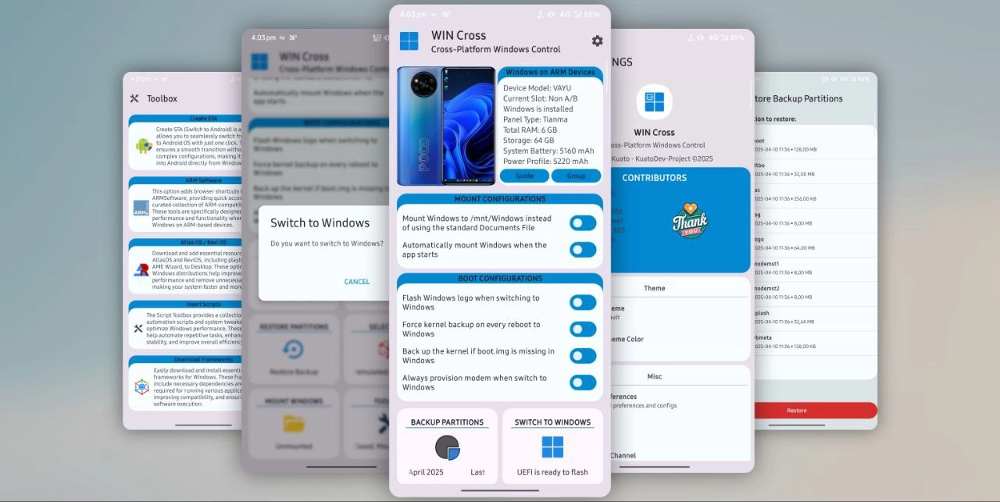

# WINCross

WINCross: Cross-Platform Windows Control (formerly WoA Helper) is a cross-platform utility designed to manage dual-boot environments between Windows and Android on your device. WINCross allows you to perform various Windows control and optimization tasks directly from Android—no need to reboot into Windows.

Ideal for power users and developers, WINCross offers an efficient way to manage and maintain your Windows from Android, streamlining cross-OS operations on a single device.

## About
This application is built using Gradle on a Poco X3 Pro. Images are created with [Photo Editor](https://play.google.com/store/apps/details?id=com.iudesk.android.photo.editor) and converted into [Vector Drawables](https://inloop.github.io/svg2android/). Debugging, LogListener, and compiling are done using [AndroidIDE](https://m.androidide.com), while [Termux](https://github.com/termux) is used for various tasks in building this application.

## Disclaimer
We are not responsible for bricked devices, missing recovery partitions, dead microSD cards, runaway pets, nuclear wars, or you getting fired because you flashed UEFI, provisioned modems, or dumped sensors using this app. **USE AT YOUR OWN RISK!**

## Project Status
Most features work, but some cases may not. Please read the  carefully.

Most features are supported; however, certain scenarios or configurations may not be fully compatible. Please ensure you carefully review the [Requirements](#requirements) and [Device Specific Features](#device) sections for detailed compatibility information.

## Requirements
- Android 12 and up
- Dual Boot Android And Windows Devices
- Rooted Devices (Magisk/KernelSU)

## Permissions
- [x] **SuperUser** - Used to Mount/Unmount Windows partition inside Android OS
- [x] **INTERNET** - Used to load device images and download necessary files
- [x] **ACCESS_NETWORK_STATE** - Same as INTERNET permission, needed for higher API
- [x] **POST_NOTIFICATIONS** - Used to post notifications while downloading necessary files
- [x] **MANAGE_EXTERNAL_STORAGE** - Used to backup/restore and manage Windows
- [x] **RECEIVE_BOOT_COMPLETED** - Used to make Widget work
- [x] **SCHEDULE_EXACT_ALARM** - Used to keep widget accessible
- [x] **FOREGROUND_SERVICE_DATA_SYNC** - Used to prevent widget from being killed during OOM

## Features and Progress
- [x] Mount Windows to Android (mount windows partitions in android)
- [x] Backup Partitions (backup necessary partitions for safety)
- [x] Restore Backup Partitions (restore back up partitions except PERSISIT)
- [x] Insert ReviOS/AtlasOS Playbook into Windows (customized windows playbook for optimizing performance)
- [x] Insert Frameworks to Windows (Various Windows frameworks installer)
- [x] Flash UEFI (select and flash UEFI to boot partitions)
- [x] UEFI Update Notifications (Only tested on Vayu and Nabu)
- [x] Switch to Windows (switch to Windows just in click)
- [x] Widget Switch to Windows (switch to Windows from home screen with widget)
- [x] Insert Varieties Script to Windows (insert varieties WOA Script Toolbox)
- [x] Add Switch to Android (STA) (create Switch To Android for Windows)

## Device
#### VAYU ( POCO X3 Pro)
- [x] Mount/Unmount Windows Works
- [x] Backup Partitions Works
- [x] Flash UEFI Works
- [x] UEFI Update Works
- [x] Restore Backup Partitions Works

#### NABU ( Xiaomi Pad 5 )
- [x] Mount/Unmount Windows Works 
- [x] Flash UEFI Works
- [x] UEFI Update Works
- [x] Backup Partitions Works
- [x] Flash UEFI Works
- [x] Restore Backup Partitions Works